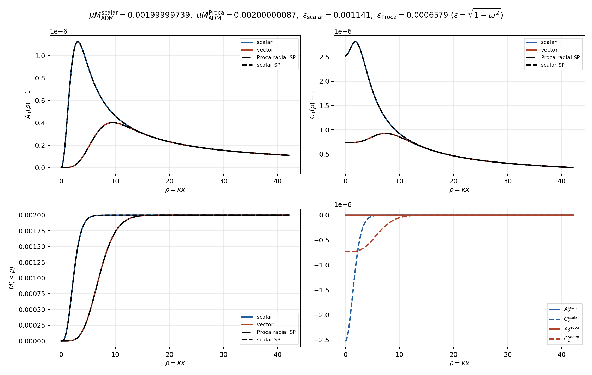
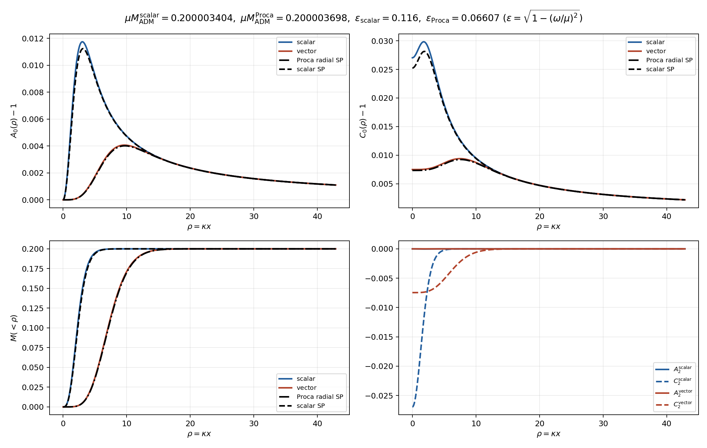
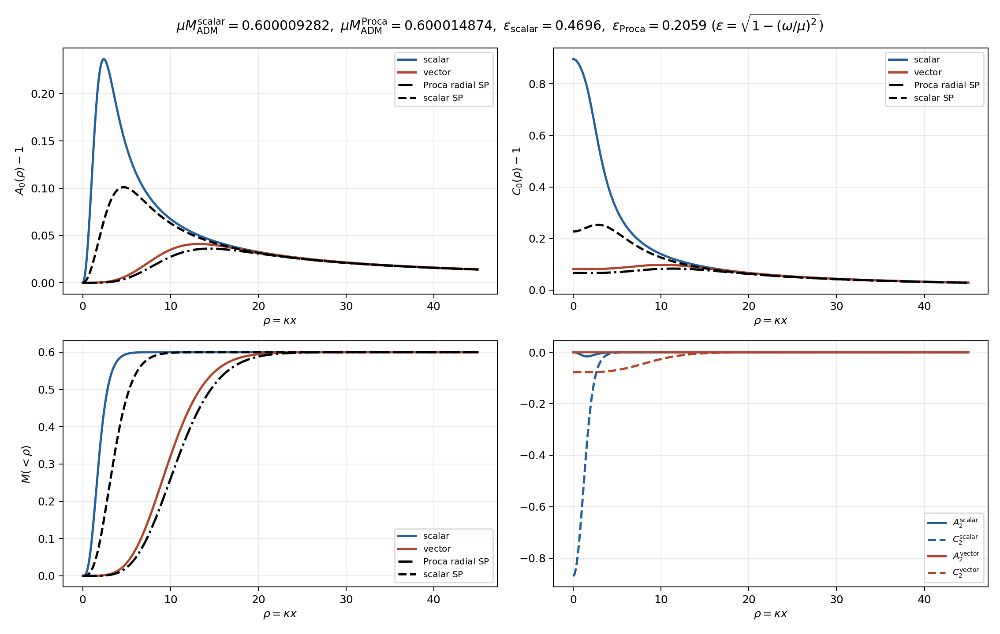
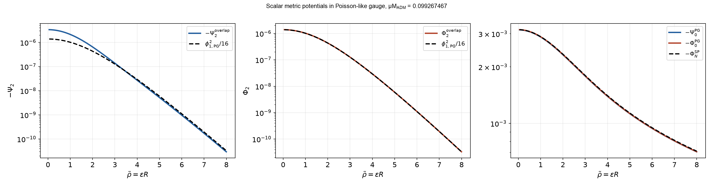
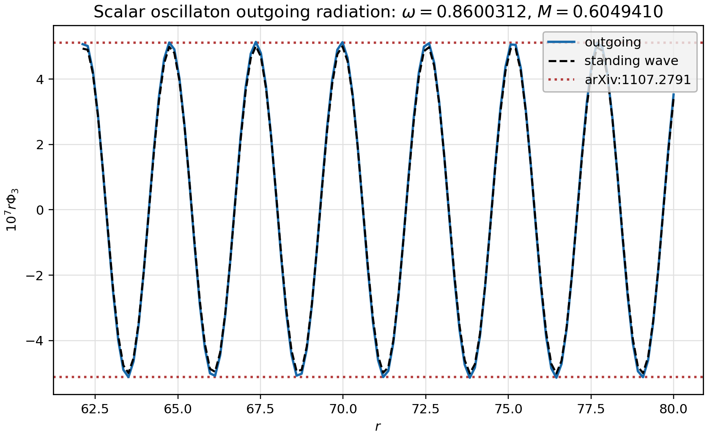
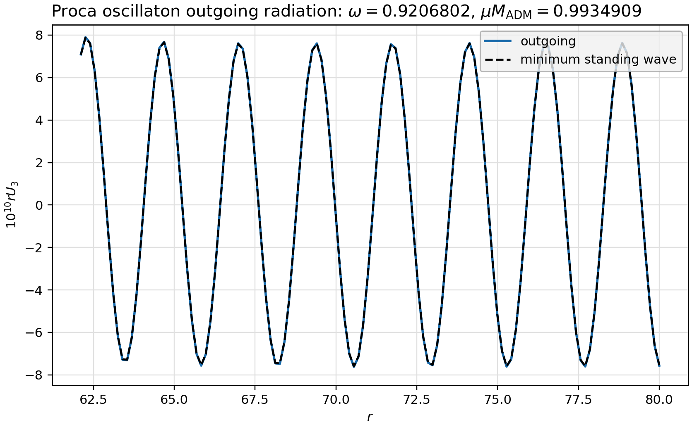

# Spherical Soliton & Oscillaton Constructor

Numerical constructors for spherically symmetric (Newtonian) solitons and (relativistic) oscillatons of real scalar and real Proca fields in Einstein gravity.

<p align="center">
  
</p>
<p align="center"><i>g</i><sub>00</sub>(t,x) of a spherical Proca oscillaton; parameters: <code>mu*M_ADM=0.600014874, omega=0.978575355, epsilon=0.205888987, jmax=6</code></p>

## Installation

```bash
git clone https://github.com/cao-yan-phys/spherical-soliton-oscillaton-constructor.git
cd spherical-soliton-oscillaton-constructor
python -m pip install -r requirements.txt
```

Relativistic profiles are constructed in polar-areal coordinates. The input `target_mass` is the dimensionless mass $\mu M_{\mathrm{ADM}}$ in units $G=c=\hbar=1$, where $\mu$ is the boson mass and $M_{\mathrm{ADM}}$ is the oscillaton mass. The returned `omega` is $\omega_{\mathrm{phys}}/\mu$.

## Basic Usage

### Full Profiles

```python
from oscillaton_builders import (
    construct_scalar_oscillaton,
    construct_vector_oscillaton,
)

scalar = construct_scalar_oscillaton(target_mass=0.2)
proca = construct_vector_oscillaton(target_mass=0.2)

print(scalar.mass, scalar.omega)
print(proca.mass, proca.omega)

scalar_initial_data = scalar.initial_data()
proca_initial_data = proca.initial_data()
```

The returned profile objects provide `x`, `omega`, `mass`, `A0`, `C0`, `mass_profile`, `evaluate(theta)`, and `initial_data()`.

### Nonrelativistic References

```python
from kg_oscillaton import solve_sp_ground_state
from proca_oscillaton import solve_radial_proca_nr_ground_state

scalar_sp = solve_sp_ground_state()
proca_sp = solve_radial_proca_nr_ground_state()
```

### Scalar Outgoing Radiation

```python
from kg_oscillaton import solve_scalar_outgoing_radiation

radiation = solve_scalar_outgoing_radiation()
print(radiation.omega, radiation.mass, radiation.c3_outgoing)
print(radiation.mass_loss_rate)
```

## Examples

<p align="center"></p>

<p align="center"></p>

<p align="center"></p>

<p align="center"></p>

### Radiation Loss

Harmonic modes satisfying $j\omega_{\mathrm{phys}}>\mu$ propagate in the wave zone. For the configurations below, the leading outgoing-radiation channel is $j=3$, and its energy flux determines the mass-loss rate. The scalar outgoing-radiation amplitude is compared with [arXiv:1107.2791](https://arxiv.org/abs/1107.2791), while the Proca result is checked against the corresponding minimum-amplitude standing-wave construction.

<p align="center"></p>

<p align="center"></p>
